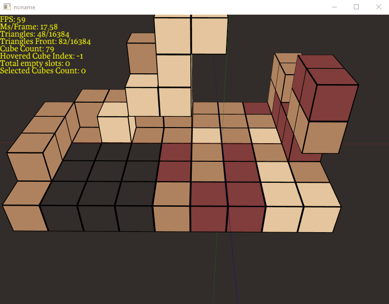
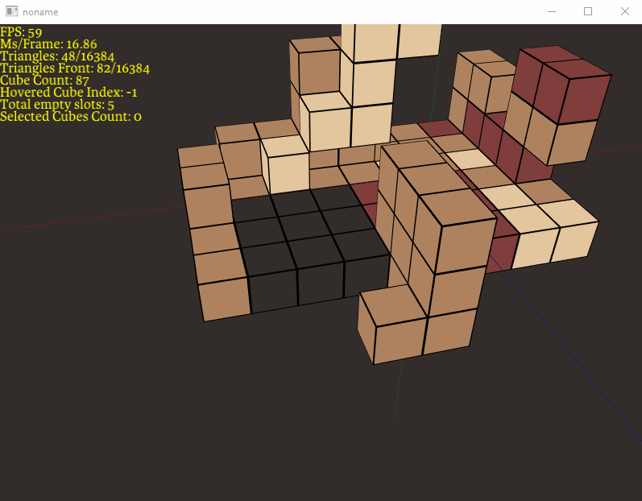

## Program
- OpenGL program written in C, from scratch.
- Unity build (All code is compiled as one translation unit)
- Minimal external dependencies: GLFW, stb_image.h and stb_truetype.h
- Custom core library at `src/f_base/*` which includes math, arena allocator, file I/O, strings and thread context.
- This is not a very good program, it was me learning opengl and writing a renderer from scratch, without external sources or research. Failing was the goal.
- Because I'm (mostly) not using external cross-platform dependencies, this application is windows only, since the os layer of my base cose only has Win32 code implemented (even though this is opengl).

### Renderer 
- There are no meshes. Cubes, arrows and quads (which are all the rendered objects in this program) are defined mathematically and the renderer has enough context to know how to render them.
- Program is rendered into a MSAA offscreen FBO that aplies anti aliasing. Then this is copied into a intermidiate FBO that applies post processing (No post processing is happening in the program though). Then it is rendered into texture quad, which is the actual screen.
- Font rendering. I use stb_truetype.h to load the font data into a struct and save the atlas. Then I've implemented culling and rendering the flipped texture.

### Adding, removing and selecting
- Hover cubes, highlight hovered face and `ADD` adjacent cube or `REMOVE` hovered cube.
- Select one ore more cubes.
- 

- Selecting 1 cube spawn a translation gizmo.
- Translation gizmo contains 1 arrow for each axis and one panel for each plane.
- Each arrow and plane can be clicked to translate the cube 1 unit in the appropriate direction.

- F1 to F4 keys change color of selected cubes
- DELETE deletes all selected cubes

### Hotloading Files
#### Tweak variables
- `Variables.hotload` contains `\Startup` header with variables that are loaded on init.
- `Variables.hotload` contains variables that can be hotloaded at runtime, simply by changing the value and saving the file.

#### Shader programs
- Edit, compile and upload shader programs at runtime just by opening the file, editing the code and saving it.
- Shader is compiled at runtime and uploaded it do the GPU. If compilation fails, prints the shader error string and shader is not uploaded but the program keeps running.

### Save file
- There's a save file that keeps the relevant Game_State on disk. CTRL+S saves the level (Camera and cubes). There is no visual feedback for saving, just look at the terminal! Only one save file is supported.
- On startup, it loads the save game. If it fails, just has some default cube data.
- Format is literally a Memory Copy of the camera structure into the file and then Memory Copy of all the cubes. There is no other information. Load first bytes as the sizeof(Camera) and then load sizeof(Cubes) until you reach EOF.

### Anti Aliasing 
- Program is rendered into a MSAA offscreen FBO that aplies anti aliasing. Then this is copied into a intermidiate FBO that applies post processing (No post processing is happening in the program though). Then it is rendered into texture quad, which is the actual screen.

### Font rendering.
- I use stb_truetype.h to load the font data into a struct and save the atlas. Then I've implemented culling and rendering the flipped texture.
- Program contains, on top left, stats about the current state of the program. 

## My personal thoughts on this project.
### Goal
It's by no means what I would consider a finished or clean program. The point was always to learn and do things I think would be interesting, not necessairly usefull.
- E.g. For the context of this program, it makes no sense to have a translation gizmo instead of a more friendly way of moving things around, I just really wanted to do that.

I set a todo list for myself for things I wanted to implement (which can be found at the beginning of `main.c`). So, I don't see this as another unfinished, but more of a "I got most of what I wanted out of this already" and I want to move on to other projects. I feel like there's more to gain for me if I start a new project or a new exercise, rather than continuing here.

### Structure
I'm not really sure how I feel about the way I structured the whole thing. The idea that I had in mind started with: `Application Layer -> Renderer`

Then the application layer divided into two things: The `Program_State` which holds more generic information about the program and `Game_State` which keeps the state for the game, so `Program_State -> Game_State -> Renderer`. I think in the future, it might even be better to also split the renderer in two, where one would be a higher level renderer definition of what API do actually want to interface with, and then a backend that abstracts the graphics API from the renderer. And while this seemed to me like unecessairy abstraction at the beginning, I felt like implementing the renderer directly with opengl code was defining the renderer API too much, to where the API would fit the opengl implementation, rather than the API I would like to interface with when I make calls to the renderer.

Overall, I still think I need a lot more experience on the balance between who's reponsible for what, and what's reasonable to abstract away, and **how** that abstraction should work.

### Renderer
I do not like how the renderer turned out at all. I'm not even sure what I would change without tearing everything down and making a new one. The idea was never to make a generic purpose renderer, so I don't particularly mind the renderer knowing about higher level objects (like cubes and arrows) but that does create problems:

There are no meshes. Cubes, arrows and quads (which are all the rendered objects in this program) are defined mathematically and the renderer has enough context to know how to render them. Not sure if that actually complicates things or not, since I had to be very careful defining how the renderer interpretes data from the Game_State, and it was a weird relationship when the Game_State needed to know how objects where rendered in worldspace (to to mouse picking, for example), so this whole thing felt a bit hacked from the beginning.

I found it hard to understand the balance between the application layer and the renderer. Especially if I wanted worldspace information about the object I'm rendering. 
  - For example, I specify an arrow in user space with 2 vectors, a base and a points_to. I pass this information to the renderer and the renderer just build the triangles from that information. This became a problem when I actually wanted to mouse pick an arrow because my application layer had no information about how the renderer was building the arrow. And while I could bring the logic that build the arrow one layer up, I'm not sure if the aplication layer should've known about triangles or quads. For this specific case though, that might've been the best option. The implementation of arrow picking now is a hack. I just create a temporary invisible cube on top of the arrow (scaled manually with hardcoded values to fit an arrow) and the cube gets picked, not the arrow.

Also, the renderer was being cleared and updated with the game state every frame. So there is a `renderer_begin_frame` which clears the primitives data and on `renderer_end_frame` it updates itself again with the updates game data, that happened in during that frame. The idea was to have one source of truth, as in, only the Game_State holds data and the renderer just updates itself with it. If I were to keep the triangle data persistent in the renderer, then that means I have duplicate state. I'm not really concerned about the memory footprint of the program (for the context of what I'm trying to do), but I am concerned about having having to make sure the Game_State and the Renderer are now being properly synced every frame. 
  - E.g. In my current implementation, there is no synchronization because there is only one state `Game_State` and the renderer updates itself every frame with it. On an implementation where the renderer keeps a persistant frame, I would have to keep track of all data that was changed and apply that change on the renderer at `renderer_end_frame`. Like, most frames the state is not updated (maybe the camera transform but that's updated every frame either way by the `Program_State`) so it wouldn't be reasonable to check every object for an updated state (which would actually defeat the purpose of a persistant renderer state). The most naieve thing I can imagine is just flagging every object that was changed and having the renderer loop through a flag changed objects thing and update it. That's something that might be good to explore further.
